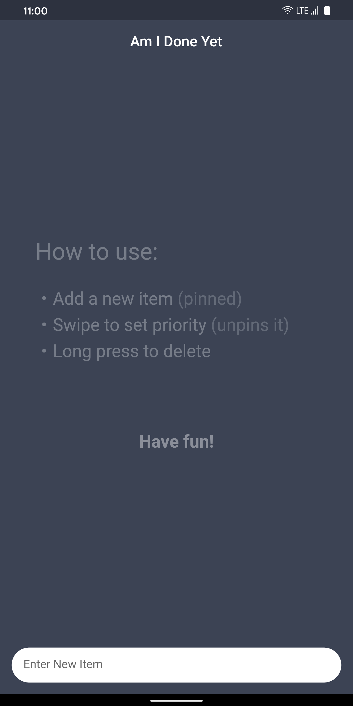
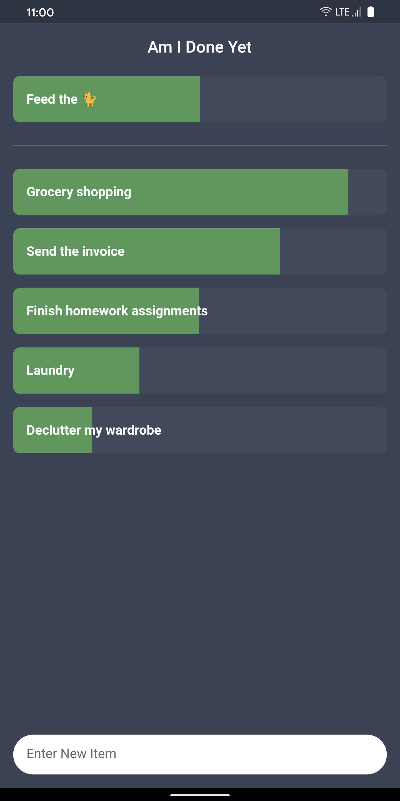

Originally, this app was my submission for the [Flutter Create](https://flutter.dev/create) challenge in 2019.
The contest submission required a Firestore backend (just to keep the source code <5kb). Aside from that, there was no benefit.
Therefore, I've rewritten the entire thing with a local database and smooth animations.

If you want to access the original source code, [check out this branch](https://github.com/ciriousjoker/am-i-done-yet/tree/original-submission).

Otherwise, here's the new version:

---

# Am I Done Yet - Todo app with a twist

Instead of rescheduling every day, just lower the priority once by swiping.

Swipe to change progress, long press to delete.

Items are sorted by priority (descending), un-prioritized items are pinned to the top.

That's it. It doesn't get simpler than that.

## Screenshots

| Main Screen (empty)                     | Main Screen                         |
| --------------------------------------- | ----------------------------------- |
|  |  |

## Run the app

If you prefer the manual way, clone the repository and do one of the following:

- `flutter run`
- `VSCode's > Run > Flutter`

A iOS App is currently unavailable as I ~~don't yet~~ still don't own a $10.000 iMac Pro to press compile on, even after winning the [Flutter Clock](https://flutter.dev/clock) contest (top 25 with [this submission](https://github.com/CiriousJoker/star_clock)). However, you're free to download the sourcecode and build it for your own. Just be nice and don't upload it to any app store.

A PWA might be an iOS replacement, but I don't see much benefit in that right now, maybe in the future. If you disagree, please create an [issue](https://github.com/CiriousJoker/am-i-done-yet/issues).

## License

This sourcecode is licensed under the [MIT license](LICENSE).

Google Play and the Google Play logo are trademarks of Google LLC.
