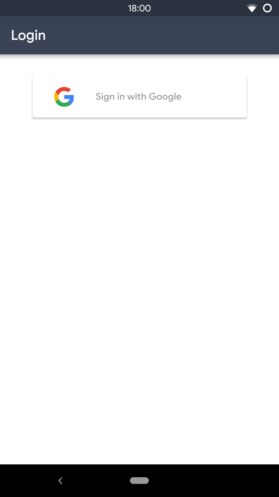
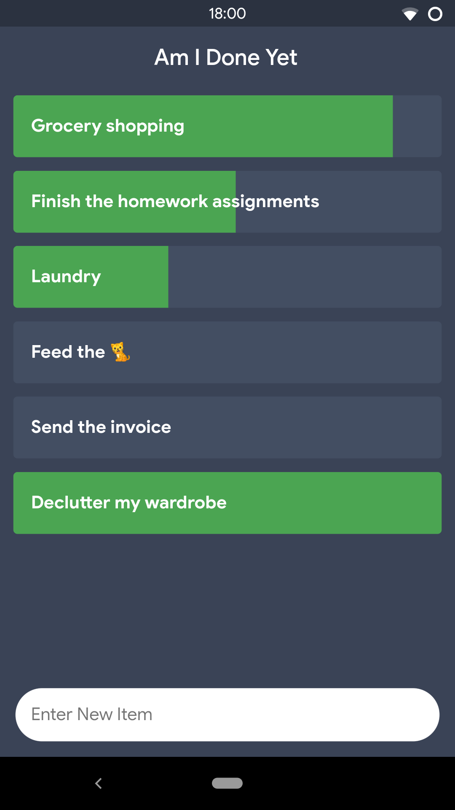

# Am I Done Yet

Swipe to change progress, long press to delete.

Items are sorted by progress (descending), completed items are at the bottom.

## Run the app

Either clone the source code and execute `flutter run` or download the app via the Google Play Store. An iOS App is currently unavailable as I don't yet own a $10.000 iMac Pro to press compile on. However, you're free to download the sourcecode and build it for your own. Just be nice and don't upload it to any app store.

## Screenshots

|                      Login                       |                      Main Screen                       |
| ------------------------------------------------ | ------------------------------------------------ |
|   |   |

## Notes

I know, that the code style used in this project isn't that good, but with only 5120 characters available, every modularized components costs 300 bytes just for the repeated import statements.

If I had this code base and an infinite amount of bytes available, I would do these things:

- write (or restore, rather) an intermediate class for App <-> Firestore communication.
- Replace all var keyword and add redundant typings where I removed them
- Extract the ListView and everything below it into a new file
- Name the variables better
- Add some comments where needed
- Use spaces instead of tabs (this conversion saved around 700 bytes alone)
- Restore all the new keywords (though I can probably get used to that)
- Add commata to the end of statements (improves formatting, but means that more indentations are needed. Currently, indentation is minimized almost to the max.)

Just check the [firestore rules](./firestore.rules), I do know what good code style looks like.

## License

This work is licensed under a [Creative Commons Attribution-NonCommercial-ShareAlike 4.0 International License](https://creativecommons.org/licenses/by-nc-sa/4.0/).

